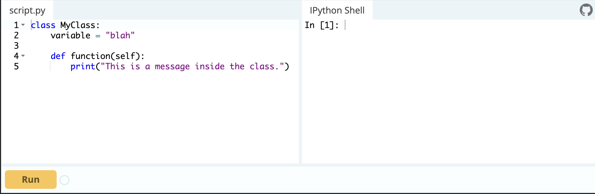
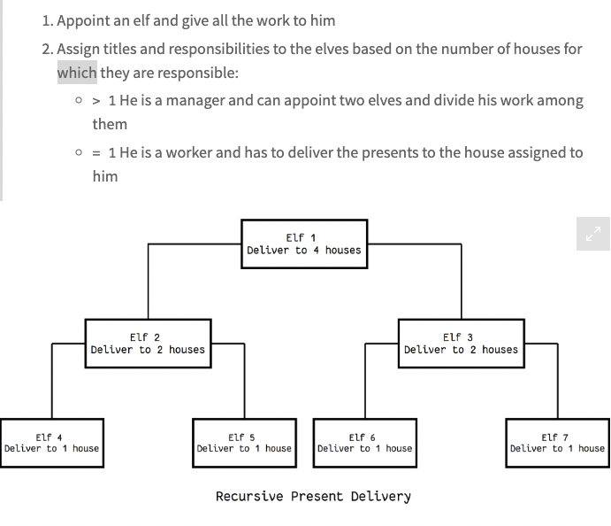
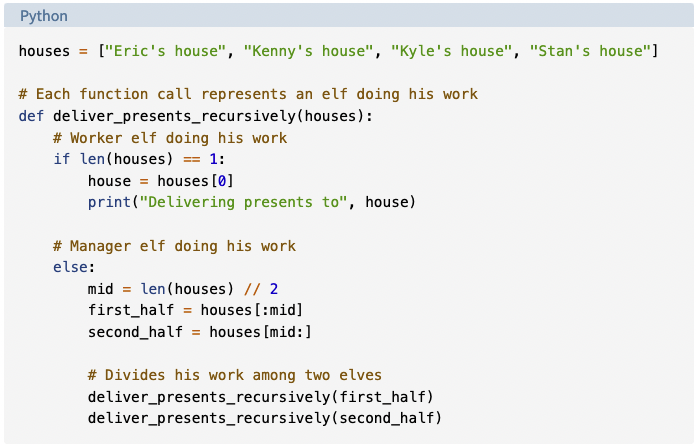
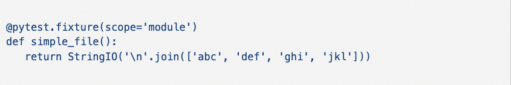

# Class-04

## ****Classes and Objects****

Objects are an encapsulation of variables and functions into a single entity. Objects get their variables and functions from classes. Classes are essentially a template to create objects.

A very basic class would look something like this:

Classes can be placed within objects.

To access the variable inside of the newly a created object you would use object_name.variable_name. I.E print(obj1.var1)

Class functions are accessed in a similar way.

The `__init__()` function, is a special function that is called when the class is being initiated. It's used for assigning values in a class.

## ****Thinking Recursively in Python****

This is the typical structure of a recursive algorithm. If the current problem represents a simple case, solve it. If not, divide it into subproblems and apply the same strategy to them.

A recursive function is a function defined in terms of itself via self-referential expressions

This means that the function will continue to call itself and repeat its behavior until some condition is met to return
 a result. All recursive functions share a common structure made up of two parts: base case and recursive case.

### **Recursive Data Structures in Python**

A data structure is recursive if it can be defined in terms of a smaller version of itself. A list is an example of a recursive data structure.

Recursion can also be seen as self-referential function composition. We apply a function to an argument, then pass that result on as an argument to a second application of the same function, and so on. Repeatedly composing `attach_head` with itself is the same as `attach_head` calling itself repeatedly.

`lru_cache` is a decorator that caches the results. Thus, we avoid re-computation by explicitly checking for the value before trying to compute it

## **Python Testing with Pytest: Fixtures and Coverage**

Fixtures are objects that are available to all of your tests. Those objects might contain data you want to share across tests, or they might involve the network or filesystem. 

In pytest, you define fixtures using a combination of the `pytest.fixture`
 decorator, along with a function definition.

You then can mention it in a test's parameter list to access it in any test. Fixtures are  actually  functions under the hood, which means they execute every time you invoke a test using the fixture. This means that the fixture, in contrast with regular-old data, can make calculations and decisions.

You can also set a  fixture's "scope” to use it multiple times without creating it again. If you set the scope of the fixture to be "module", it'll be available throughout your tests but will execute only a single time You can do this by passing the `scope` parameter to the `@pytest.fixture` decorator:

This is not recommended.

When software gets large and more complex, it's not as easy to test all aspects. That where you want to have "code coverage", checking that your tests have run all of the code. There's a package called pytest-cov on PyPI that you can download and install. Once that's done, you can invoke pytest with the `--cov` option. If you don't say anything more than that, you'll get a coverage report for *every* part of the Python library that your program used.
