# SQL

SQL, or Structured Query Language, is a language designed to allow both technical and non-technical users query, manipulate, and transform data from a relational database

---

## Relational DB

A relational database represents a collection of related (two-dimensional) tables, each with a fixed number of named columns (the attributes or properties of the table) and any number of rows of data. For example:

| Id | Make/Model | # Wheels | # Doors | Type |
| --- | --- | --- | --- | --- |
| 1 | Ford Focus | 4 | 4 | Sedan |
| 2 | Tesla Roadster | 4 | 2 | Sports |
| 3 | Kawasaki Ninja | 2 | 0 | Motorcycle |
| 4 | McLaren Formula 1 | 4 | 0 | Race |
| 5 | Tesla S | 4 | 4 | Sedan |

To retrieve data from a SQL database, we write SELECT statements, or queries. A query declares what data we want, its location in the database, and how to transform it before it is returned.

SELECT column, another_column, …
FROM my-table;

- retrieves the requested set of rows and columns

SELECT *
FROM my-table;

- the asterisk requests all the present data in the table

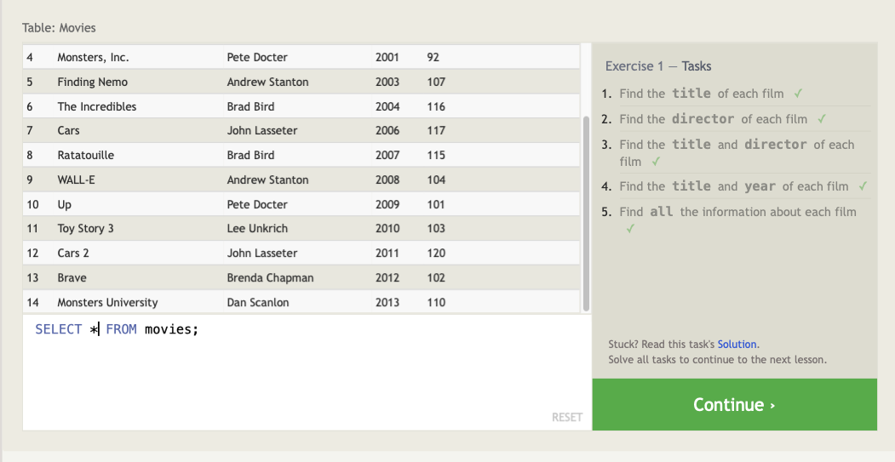

- To select multiple columns, separate the names in the SELECT statement by a comma.

---

## Queries with Constraints

In order to filter results from a specific location, use a WHERE clause in the query. The clause is applied to each row of data by checking specific column values to determine whether it should be included in the results or not.

SELECT column, another_column, …
FROM my-table

**WHERE *condition***

**AND/OR *another_condition***

**AND/OR …**;

- More complex clauses can be constructed by joining numerous **AND** or **OR**
 logical keywords

### Useful Operators

| Operator | Condition | SQL Example |
| --- | --- | --- |
| =, !=, < <=, >, >= | Standard numerical operators | col_name != 4 |
| BETWEEN … AND … | Number is within range of two values (inclusive) | col_name BETWEEN 1.5 AND10.5 |
| NOT BETWEEN … AND … | Number is not within range of two values (inclusive) | col_name NOT BETWEEN 1 AND10 |
| IN (…) | Number exists in a list | col_name IN (2, 4, 6) |
| NOT IN (…) | Number does not exist in a list | col_name NOT IN (1, 3, 5) |

- Using clauses speeds queries up due to the reduction of unnecessary data.
- Keywords are not required to be capitalized, but is used as a readability convention

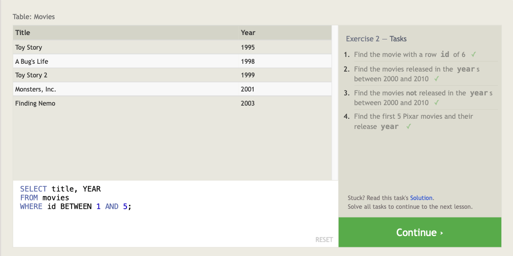

---

### More Useful Operators

| Operator | Condition | Example |
| --- | --- | --- |
| = | Case sensitive exact string comparison (notice the single equals) | col_name = "abc" |
| != or <> | Case sensitive exact string inequality comparison | col_name != "abcd" |
| LIKE | Case insensitive exact string comparison | col_name LIKE "ABC" |
| NOT LIKE | Case insensitive exact string inequality comparison | col_name NOT LIKE "ABCD" |
| % | Used anywhere in a string to match a sequence of zero or more characters (only with LIKE or NOT LIKE) | col_name LIKE "%AT%"(matches "AT", "ATTIC", "CAT" or even "BATS") |
| _ | Used anywhere in a string to match a single character (only with LIKE or NOT LIKE) | col_name LIKE "AN_"(matches "AND", but not "AN") |
| IN (…) | String exists in a list | col_name IN ("A", "B", "C") |
| NOT IN (…) | String does not exist in a list | col_name NOT IN ("D", "E", "F") |

- All strings must be quoted so that the query parser can distinguish words in the string from SQL keywords.

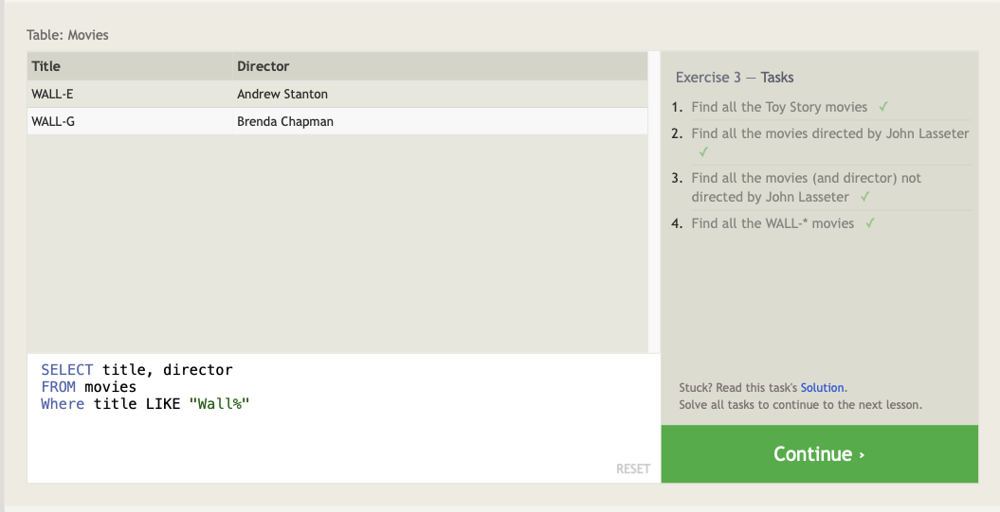

---

## ****Filtering and Sorting Query Results****

Data returned by a query may not be unique, so it is possible to discard duplicate rows by using the **DISTINCT** keyword.

SELECT **DISTINCT** column, another_column, …
FROM my-table
WHERE *condition(s)*;

- It is possible to discard duplicates based on specific columns using the **GROUP BY** clause.

Data returned by a query may not be in any particular order, so the **ORDER BY** clause can be used to sort results in an ascending or descending order.

SELECT column, another_column, …
FROM my-table
WHERE *condition(s)*

**ORDER BY column ASC/DESC**
    - The **LIMIT** and **OFFSET** clauses are  commonly used in conjunction with the **ORDER BY** clause to indicate to the database the subset of the desired results. **LIMIT** will reduce the number of rows to return, and the optional **OFFSET** will specify where to begin counting the number rows from.

SELECT column, another_column, …
FROM my-table
WHERE *condition(s)*

ORDER BY column ASC/DESC

**LIMIT num_limit OFFSET num_offset;**

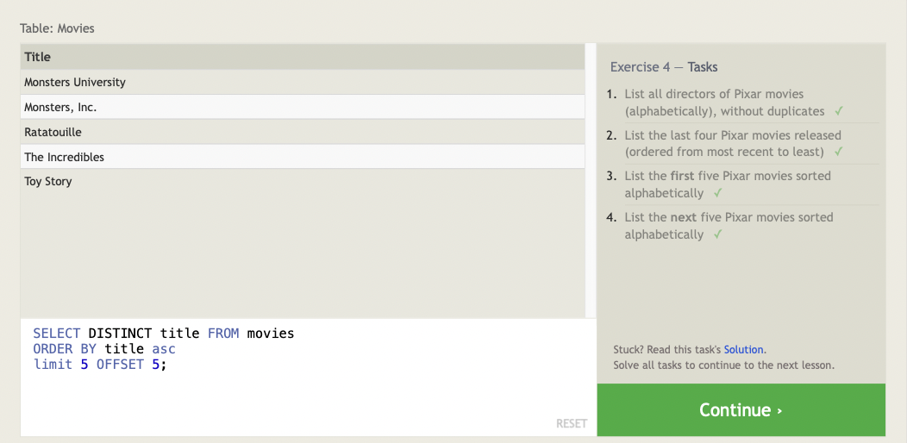

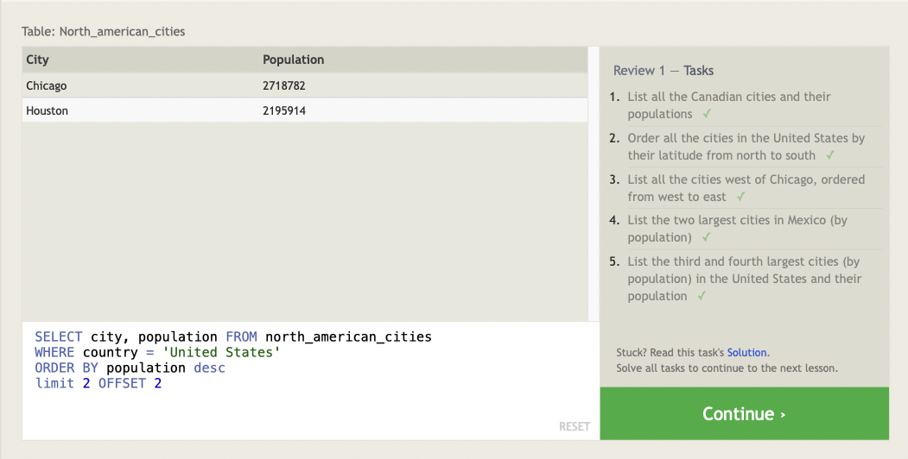

## ****Multi-table queries with JOINs****

Data  is often broken down into pieces and stored across multiple orthogonal tables using a process known as *normalization.*

**Database normalization**
    - Normalization minimizes duplicate data in any single table, and allows for data in the database to grow independently of each other. This, in turn, causes queries to get slightly more complex since they have to be able to find data from different parts of the database, and performance issues can arise when working with many large tables.

**Multi-table queries with JOINs**
    - Tables that share information about a single entity need to have a *primary key* that identifies that entity *uniquely* across the database. One common primary key type is an auto-incrementing integer (because they are space efficient), but it can also be a string, hashed value, so long as it is unique.

The **JOIN** clause allows a query to combine row data across two separate tables using this unique key.

SELECT column, another_table_column, …
FROM my-table

**INNER JOIN another_table
    ON mytable.id = another_table.id (mytable.id = another_table.mytable_id)**

WHERE *condition(s)*

ORDER BY column, … ASC/DESC
LIMIT num_limit OFFSET num_offset;

The **INNER JOIN** is a process that matches rows from the first table and the second table which have the same key (as defined by the **ON** constraint) to create a result row with the combined columns from both tables. After the tables are joined, the other clauses we learned previously are then applied.

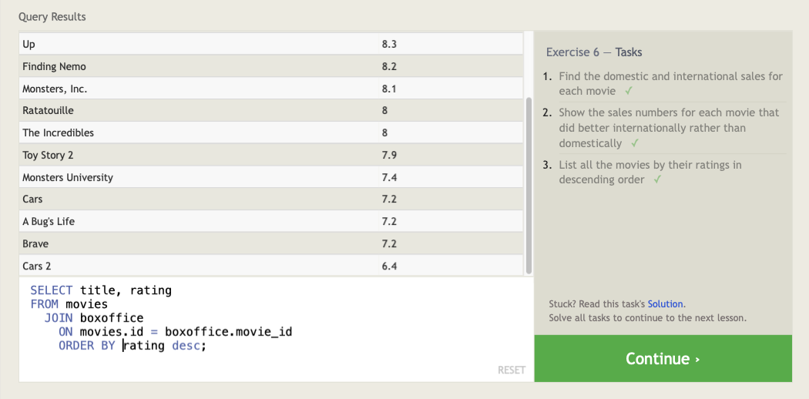

---

## ****Inserting rows****

In SQL, the *database schema* is what describes the structure of each table, and the datatypes that each column of the table can contain. A Schema’s fixed structure allows a database to be efficient, and consistent despite storing millions or even billions of rows.

The **INSERT** statement is used to insert data into a database. **INSERT** declares which table to write into, the columns of data that we are filling, and one or more rows of data to insert. In general, each row of data you insert should contain values for every corresponding column in the table. You can insert multiple rows at a time by just listing them sequentially.

INSERT INTO mytable
VALUES (value_or_expr, another_value_or_expr, …),
(value_or_expr_2, another_value_or_expr_2, …),
…;

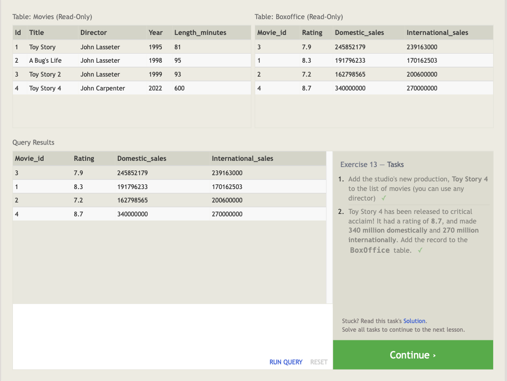

### ****Updating rows****

To update existing data the **UPDATE** keyword is used. It is necessary to specify exactly which table, columns, and rows to update. In addition, the data you are updating has to match the data type of the columns in the table schema.

UPDATE mytable
SET column = value_or_expr,
other_column = another_value_or_expr,
…
WHERE condition

- To avoid major errors when updating data, test **UPDATEs** in a **SELECT** query to make sure you are updating the right rows, and only then writing the column/value pairs to update.

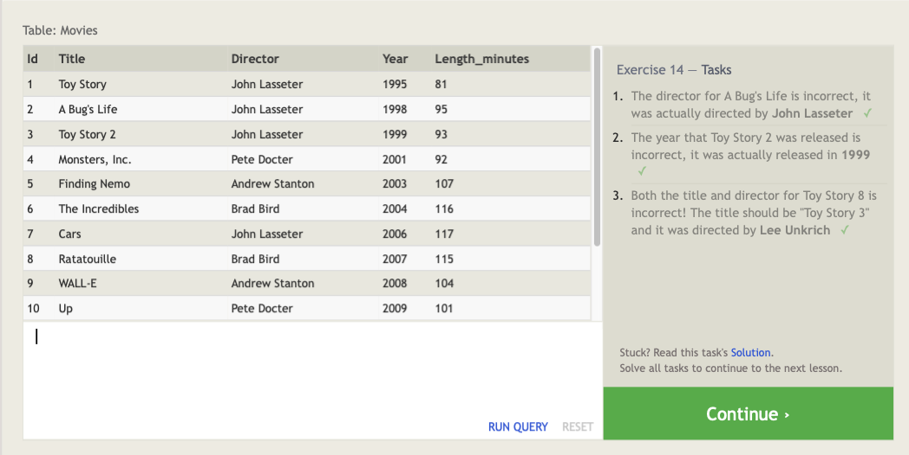

## ****Deleting rows****

The **DELETE** keyword is used in conjunction with the **WHERE** keyword to delete data

DELETE FROM mytable
WHERE condition;

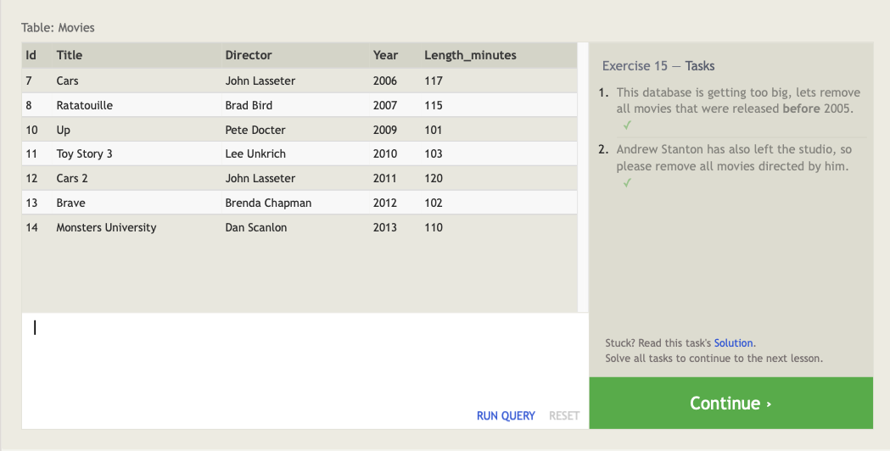

## ****Creating tables****

To create a new database table use the CREATE TABLE statement.

CREATE TABLE IF NOT EXISTS mytable (
    column *DataType TableConstraint* DEFAULT *default_value*,
    another_column *DataType TableConstraint* DEFAULT *default_value*,
    …
);

- The structure of the new table is defined by its *table schema*, which defines a series of columns. Each column has a name, the type of data allowed in that column, an *optional*
 table constraint on values being inserted, and an optional default value.

### **Table data types**

| Data type | Description |
| --- | --- |
| INTEGER, BOOLEAN | The integer datatypes can store whole integer values like the count of a number or an age. In some implementations, the boolean value is just represented as an integer value of just 0 or 1. |
| FLOAT, DOUBLE, REAL | The floating point datatypes can store more precise numerical data like measurements or fractional values. Different types can be used depending on the floating point precision required for that value. |
| CHARACTER(num_chars), VARCHAR(num_chars), TXT | The text based datatypes can store strings and text in all sorts of locales. The distinction between the various types generally amount to underlaying efficiency of the database when working with these columns.Both the CHARACTER and VARCHAR (variable character) types are specified with the max number of characters that they can store (longer values may be truncated), so can be more efficient to store and query with big tables. |
| DATE, DATETIME | SQL can also store date and time stamps to keep track of time series and event data. They can be tricky to work with especially when manipulating data across timezones. |
| BLOB | Finally, SQL can store binary data in blobs right in the database. These values are often opaque to the database, so you usually have to store them with the right metadata to requery them. |

Common Table Constraints

| Constraint | Description |
| --- | --- |
| PRIMARY KEY | This means that the values in this column are unique, and each value can be used to identify a single row in this table. |
| AUTOINCREMENT | For integer values, this means that the value is automatically filled in and incremented with each row insertion. Not supported in all databases. |
| UNIQUE | This means that the values in this column have to be unique, so you can't insert another row with the same value in this column as another row in the table. Differs from the `PRIMARY KEY` in that it doesn't have to be a key for a row in the table. |
| NOT NULL | This means that the inserted value can not be `NULL`. |
| CHECK (expression) | This allows you to run a more complex expression to test whether the values inserted are valid. For example, you can check that values are positive, or greater than a specific size, or start with a certain prefix, etc. |
| FOREIGN KEY | This is a consistency check which ensures that each value in this column corresponds to another value in a column in another table.For example, if there are two tables, one listing all Employees by ID, and another listing their payroll information, the `FOREIGN KEY` can ensure that every row in the payroll table corresponds to a valid employee in the master Employee list. |
|  |  |

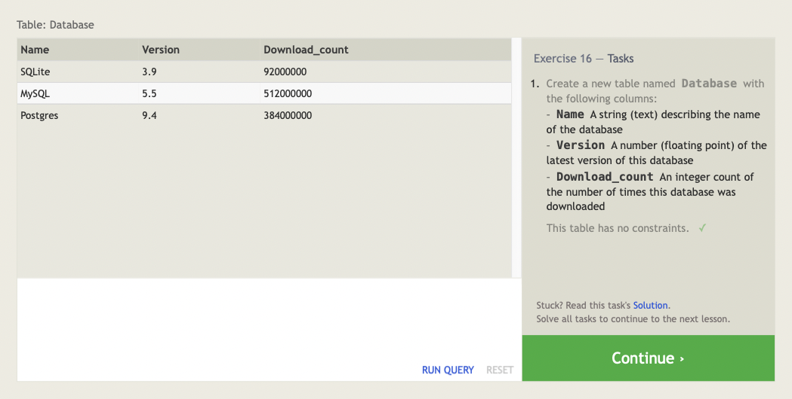

## ****Altering tables****

The **ALTER TABLE** statement is used to add, remove, or modify columns and table constraints.

it is necessary to specify the data type of the column along with any potential table constraints and default values to be applied to both existing *and* new rows.

ALTER TABLE mytable
ADD column *DataType OptionalTableConstraint*

DEFAULT default_value;

The **DROP** clause is used to remove columns, although it is not supported in all databases.

ALTER TABLE mytable
DROP column_to_be_deleted;

The **RENAME TO**  clause is used to rename tables.

ALTER TABLE mytable
RENAME TO new_table_name;

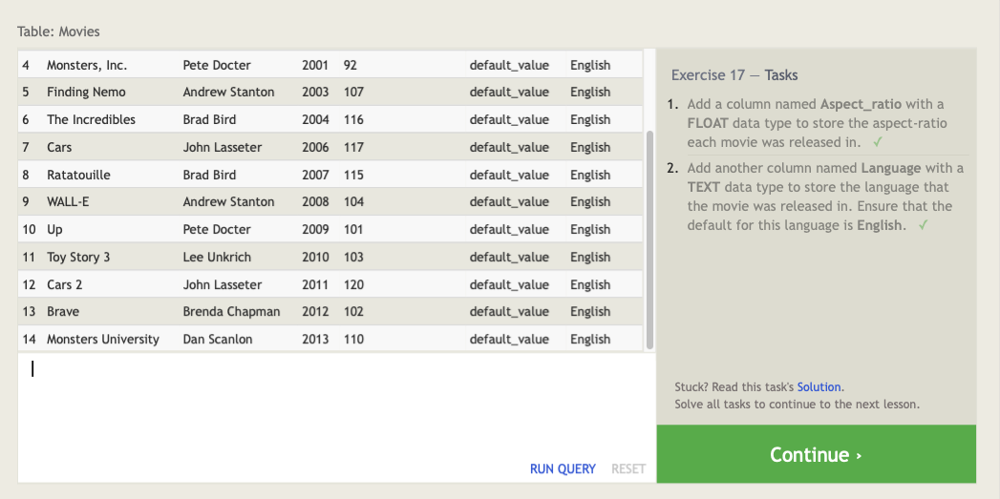

The **DROP** statement differs from the **DELETE** statement in that it also removes the table schema from the database entirely.

DROP TABLE IF EXISTS mytable;

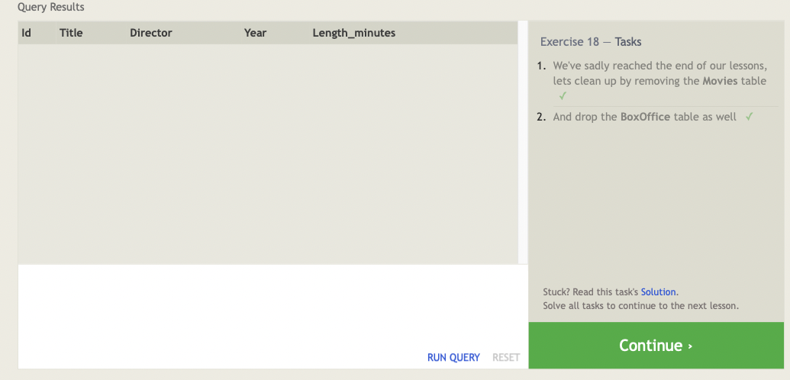
