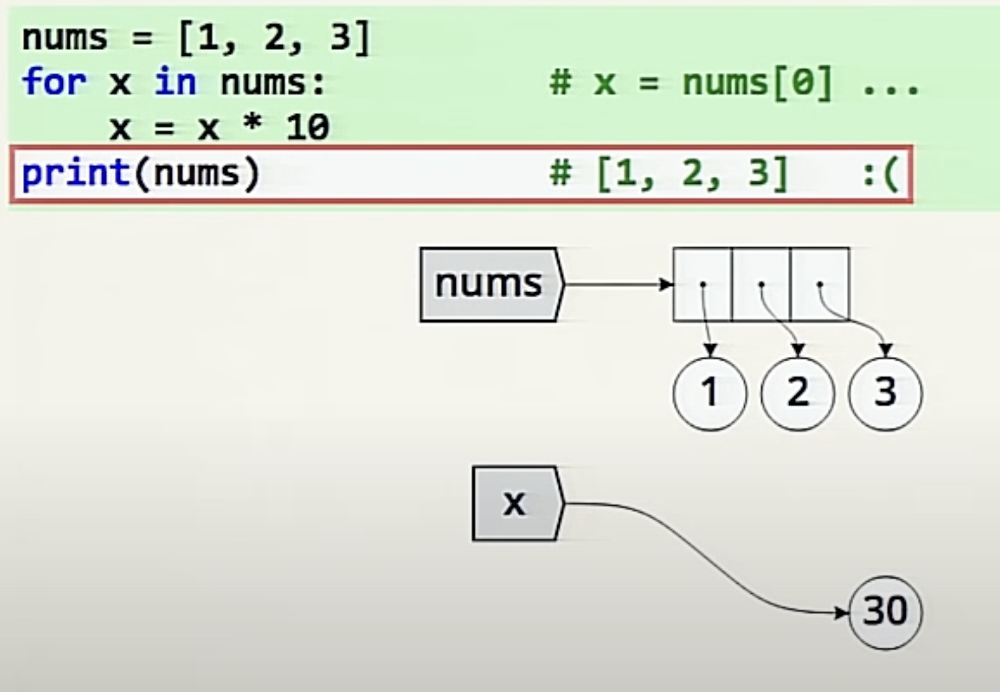
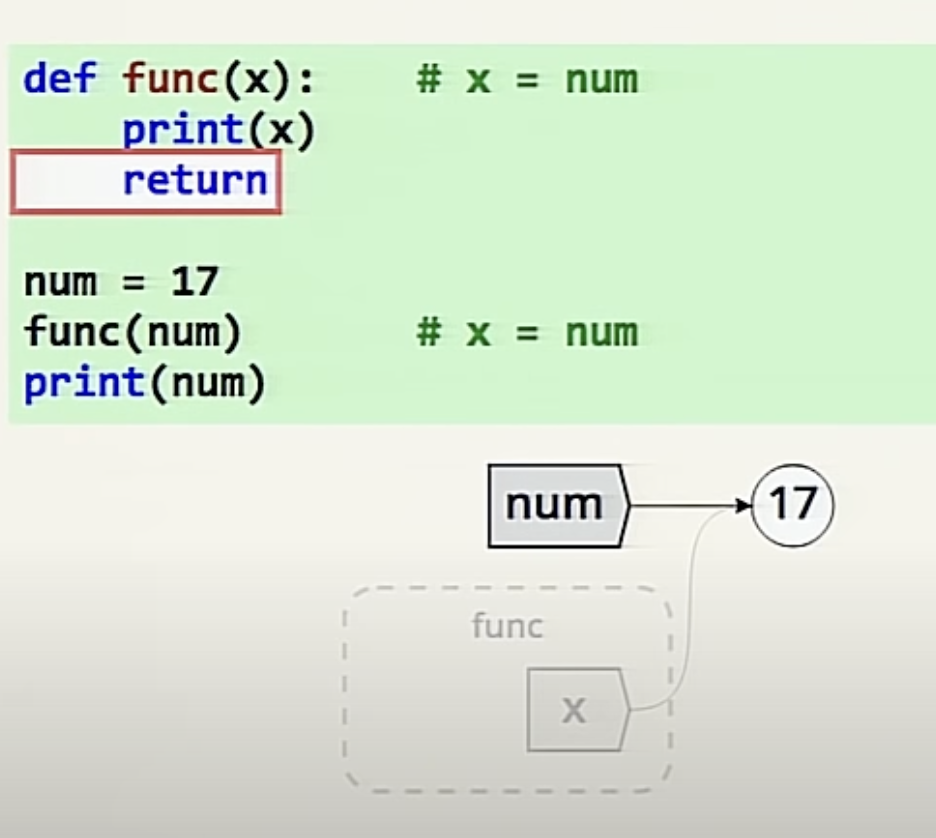
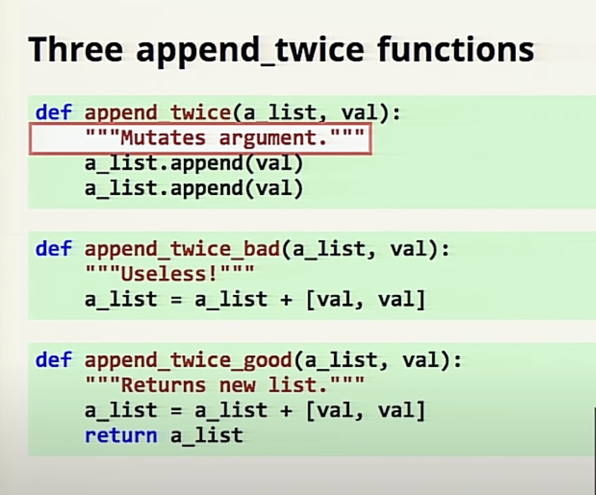
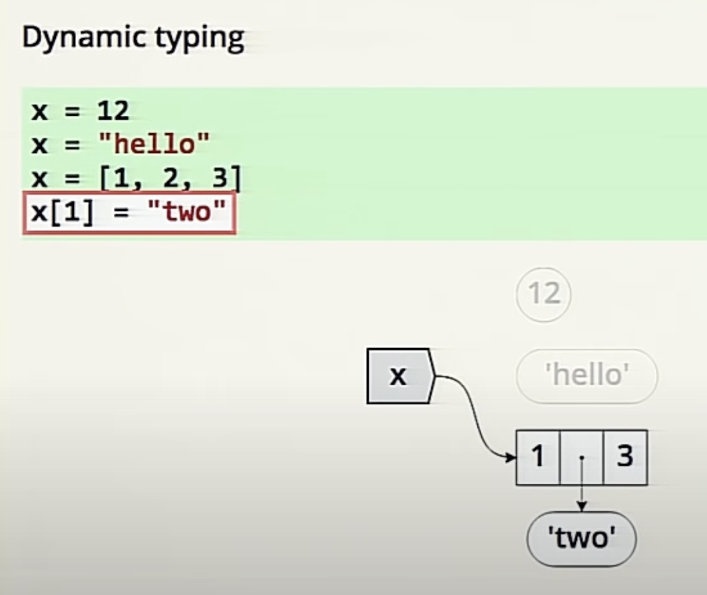
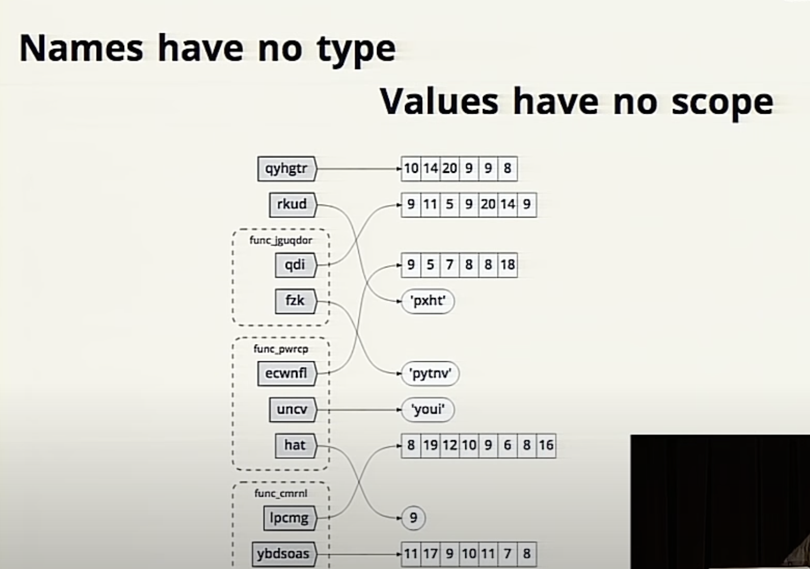

# Python myths

- Names refer to values
  - Many names refer to one value
- Names are assigned independently
- Values live until no references, values are removed once there are no names referring to them
- Assignment never copies data

    nums = [1,2,3];

    other = nums (this does not copy the data into other, both refer to the same list)

    nums.append(4)

    print(other) this prints [1,2,3,4] it’s the same list, therefore changes are visible through all names

## Mutable aliasing

- With mutable values where there are more than one name, when the value changes, all names are effected

### Immutable values cant alias

- With ints, floats, strings, and tuples:

    x = ‘hello’

    y = x

    x = x + “ there” // y remains “hello” because strings are immutable

- Changing an int: rebinding. Ints are immutable in x = x+1, x is being rebound to a new int
- Changing a list: mutating. nums.append(7) is changing, or mutating nums
- Lists can be rebound: nums = nums + [7]. ints are immutable

Mutable and immutable objects are assigned the same. Assignment is the same for all values. Aliasing behavior makes them seem different.

References can be more than just names. List elements are references. Dict vals and keys are also references. Anything on the left of the = sign can be a reference.

### For Loops

for x in sequence:

something(x)

x is being assigned the value

x = sequence[0]

something(x)

next iteration:

x = sequence[1] (x is rebound)

something(x)

The original list nums is unchanged. The name x is being rebound

### Function arguments are assignments

X is assigned nums, and nums is assigned 17. When the function is returned the stack disappears leaving the remaining name only, nums still is 17. The reference x is removed from the value 17.

The advice given is make new lists. DONT mutate values.

Python is dynamically typed. Names can be reassigned at any time.

Names have no type, but have scope. Values have types, but no scope.

Top youtube comment:

1. Assignment never copies data.
2. Python is neither "Call By value" nor "Call By Reference", it's "Call by Assignment"! Epic!
3. There is no way in python where a name can refer to another name. A name can only refer to values. Oh my!

## From Pain vs Suffering

- All growth comes with some degree of pain
- Pain in the service of growth is a good thing
- This pain is only temporary

**Do not confuse this with suffering.**

**Suffering is pain without purpose.**

### Big O

Big O notation is used in Computer Science to describe the performance or complexity of an algorithm.

Big O specifically describes the worst-case scenario, and can be used to describe the execution time required or the space used.

- O(1) describes an algorithm that will always execute in the same time (or space) regardless of the size of the input data set.

- O(N) describes an algorithm whose performance will grow linearly and in direct proportion to the size of the input data set

- O(N²) represents an algorithm whose performance is directly proportional to the square of the size of the input data set.

- O(2^N) denotes an algorithm whose growth doubles with each addition to the input data set. The growth curve of an O(2^N) function is exponential.

## What I would like to know more about

- What actually is Big O ...
I would like to see a real world example of this, and listen to a step by step explanaition of why it is important.
